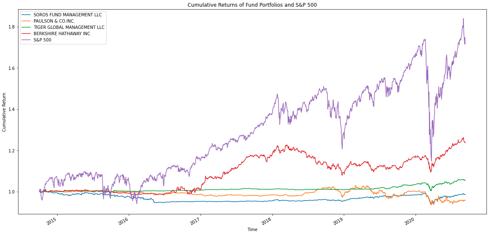

# retirement-portfolio-planning
A one stop shop solution to manage retirement portoflios. Provides in depth analysis for portfolio owners to maximize returns, but avoid risky decisions.

---

## Technologies
Jupyter, Pandas, Numpy, CSV and pathlib.

---

## Installation Guide
Not applicable at the moment, will be released at a later date.

---

## Usage

---

## Contributors

Name: Keenan Heller
Email: keenanaheller@gmail.com
LinkedIn: https://www.linkedin.com/in/keenanheller/
---

## License

MIT License
